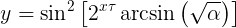
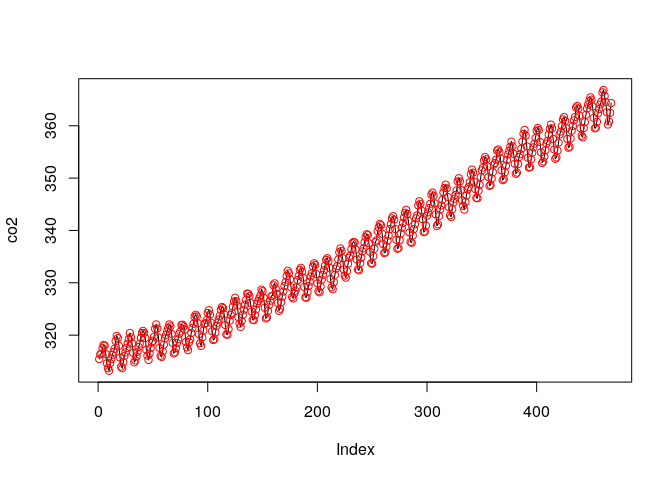

<!-- README.md is generated from README.Rmd. Please edit that file -->

# spfit

<!-- badges: start -->

[](https://travis-ci.org/eliocamp/spfit)
<!-- badges: end -->

spfit (**S**ingle **P**arameter Fit) is an R implementation of Laurent
Boué’s [Real numbers, data science and chaos: How to fit any dataset
with a single parameter](https://arxiv.org/abs/1904.12320). It can take
any data and fit a continuous and differenciable model with just one
parameter with arbitrary accuracy:

<p align="center">



</p>

## Installation

You can install the development version from
[GitHub](https://github.com/) with:

``` r
# install.packages("devtools")
devtools::install_github("eliocamp/spfit")
```

<!-- the released version of spfit from [CRAN](https://CRAN.R-project.org) with:

``` r
install.packages("spfit")
```
-->

## Example

Fit the rise of CO2 perfectly with one parameter

``` r
library(spfit)
data("co2") 
co2 <- c(co2)

co2_fit <- sp_fit(co2)

co2_pred <- predict(co2_fit)

plot(co2, type = "l")
points(predict(co2_fit), col = "red")
```



What’s our alpha parameter?

``` r
as.character(co2_fit, digits = 30)
#> [1] "0.0416842755182496396583250113637... (1661 more digits)"
```
